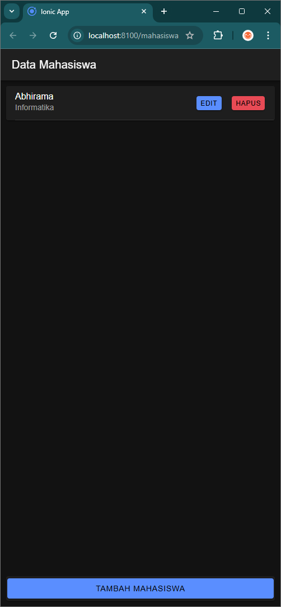
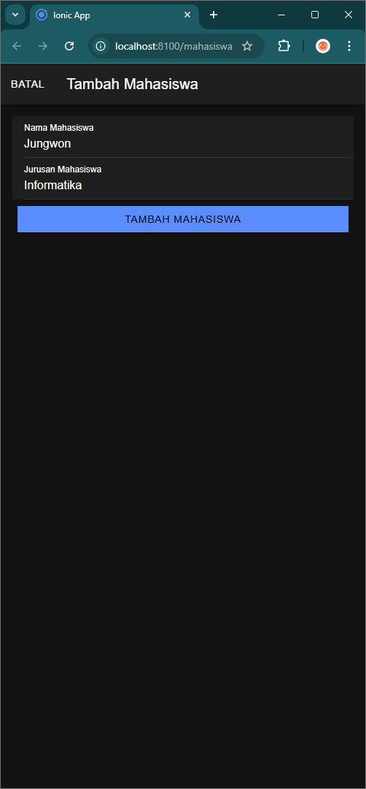
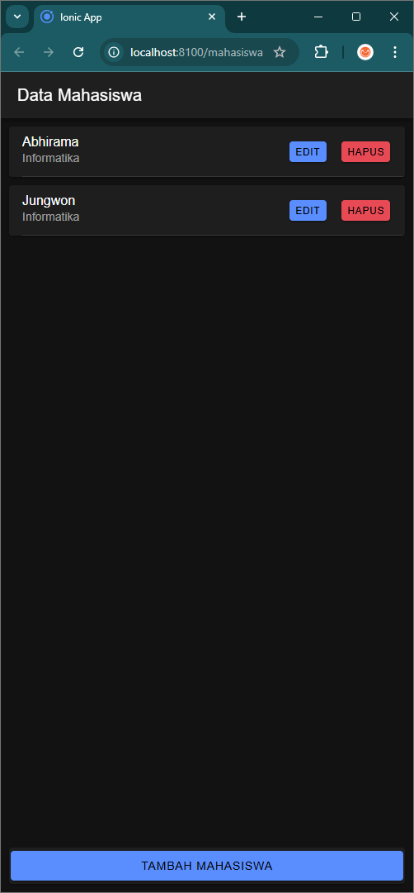
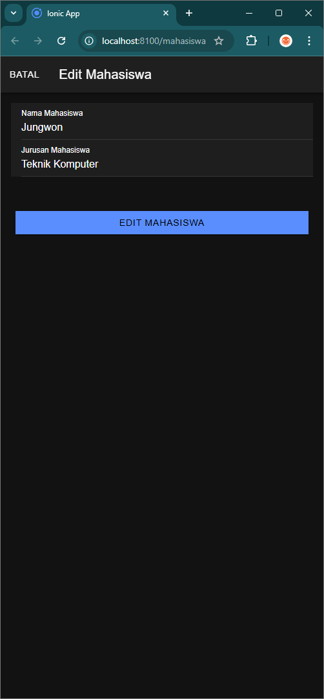
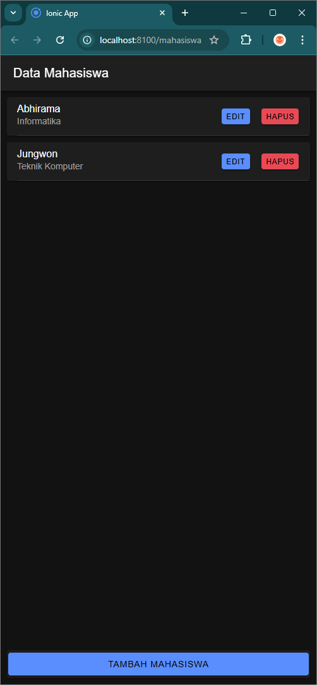
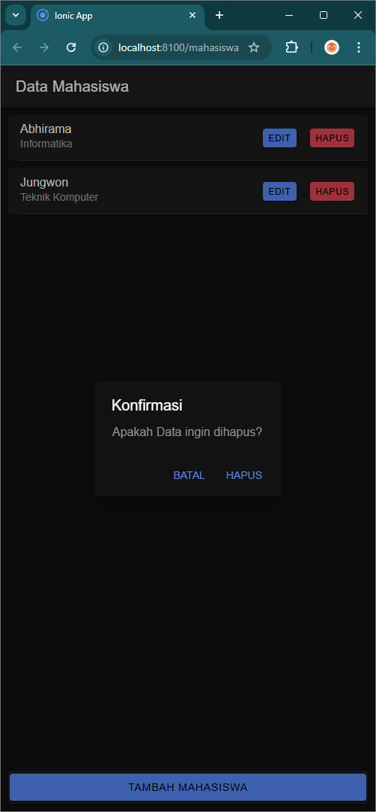

# LabMobile8_Abhirama-Rizqi-Pratama_Shift-A
 
Nama        : Abhirama Rizqi Pratama  
Nim         : H1D022099  
Shift Lama  : D  
Shift Baru  : A  

# Cara Kerja Login

Aplikasi ini menggunakan sistem autentikasi berbasis token untuk mengelola sesi pengguna. Berikut adalah langkah-langkah yang terjadi saat pengguna melakukan login:

1. **Form Login**: Pengguna memasukkan `username` dan `password` di halaman login (`login.page.html` dan `login.page.ts`).

2. **Validasi Input**: Saat tombol login ditekan, metode `login()` di `login.page.ts` akan dipanggil. Metode ini memeriksa apakah `username` dan `password` tidak kosong.

3. **Pengiriman Data**: Jika validasi berhasil, data login (username dan password) akan dikirim ke server menggunakan metode `postMethod()` dari `AuthenticationService`. Permintaan ini diarahkan ke `login.php`.

4. **Respon dari Server**: Setelah server memproses permintaan, ia akan mengembalikan respon yang berisi status login dan token jika login berhasil. Respon ini ditangani dalam blok `next` dari `subscribe()`.

5. **Penyimpanan Token**: Jika status login adalah "berhasil", token dan username akan disimpan menggunakan metode `saveData()` di `AuthenticationService`. Token disimpan di `Preferences` untuk digunakan dalam autentikasi di permintaan berikutnya.

6. **Navigasi ke Halaman Home**: Setelah berhasil login, pengguna akan diarahkan ke halaman home (`/home`).

7. **Notifikasi**: Jika login gagal, pengguna akan menerima notifikasi yang sesuai menggunakan metode `notifikasi()` dari `AuthenticationService`.

8. **Logout**: Pengguna dapat keluar dari aplikasi dengan mengklik tombol logout di halaman home. Metode `logout()` akan dipanggil, yang akan menghapus token dan username dari penyimpanan, serta mengarahkan pengguna kembali ke halaman login.

# Screenshot

  
  
  
  
  
  

